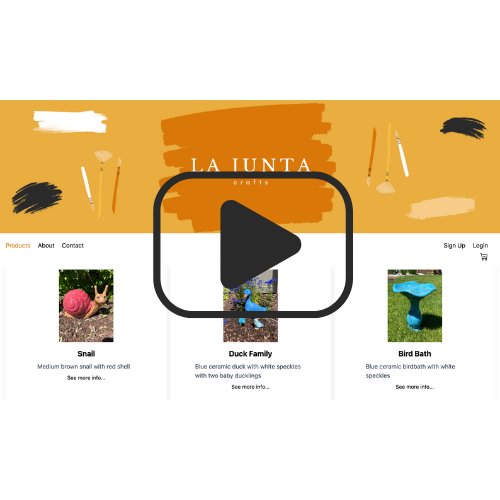

# La Junta Crafts Website

La Junta Crafts Website is a React-Flask full-stack e-commerce application. All users can browse the products available, and authenticated users can add and remove items from their session cart, update the quantity of products in their cart, and check out using Paypal, Venmo, or a debit-card card. Users can create an account or login with their Google credentials. Authenticated users can leave product reviews and can edit or delete their own reviews. The ceramic products listed on this site are actual products for sale - created by Doyle and Sandy Sebold out of their home business in La Junta, Colorado.

This site is a live site utilized by La Junta Crafts, a small business out of La Junta, CO.

## Live Site
<a href="https://lajuntacrafts.com/" title="La Junta Crafts">La Junta Crafts</a>

## Walkthrough

## Usage

Users can create an account by signing up on the Sign Up page or login with Google credentials to create a local account on La Junta Crafts. Authenticated users can leave product reviews. All users can browse the product catalogue, and authenticated users can add/update/delete items from their cart and complete the order checkout process using PayPal, Venmo, or a credit or debit card. Authenticated users can create, edit, and delete reviews for each product on the product page. Once leaving a review, the average rating for the product will update to reflect the new rating and will be displayed on the front of the product card. 

## Final Thoughts

Building this application to utilize Google authentication and PayPal was a huge milestone for me as a developer. I hope other developers can check out the front to backend logic I utilized and can try it out in their own applications. Thank you for checking out La Junta Crafts!